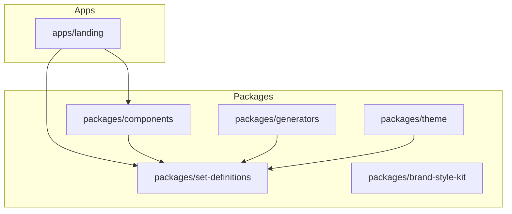

# Architecture Decisions

This document records the key architectural decisions made during the ClearLine7 monorepo refactoring.

## 1. `ThemeProvider` -> `SetDefinitionProvider`

**Decision:** The main theme provider component was renamed from `ThemeProvider` to `SetDefinitionProvider`.

**Rationale:** The term "theme" was ambiguous and could imply that users can mix and match parts of different themes (e.g., typography from one, colors from another). The new name `SetDefinitionProvider` reinforces the core concept of the library: users select one, complete, opinionated "Set Definition" that governs all styling for a document or application. This avoids confusion and clarifies the intended usage.

**Impact:**

- `packages/theme` was updated to export `SetDefinitionProvider`.
- All consuming applications (`style-guide`, `preview`, `landing`) were updated to use the new provider.
- The associated context was renamed to `SetDefinitionContext`.

## 2. `Card` Component Location

**Decision:** The `Card` component was placed in `packages/components/src/document/Card`.

**Rationale:** The `Card` component is primarily intended for use within document-like layouts, often to group content, display metadata, or create visual hierarchy in a flow of text. While it has UI-like properties, its main purpose is to structure content. Placing it in the `document/` category keeps it alongside other content-focused components like `Blockquote` and `Paragraph`.

**Alternatives Considered:**

- Placing it in `packages/components/src/ui/`. This was rejected because `Card` is more about content structure than application interface controls like `Button` or `Navigation`.

## 3. `useTheme` hook name

**Decision:** The hook to access the theme context was kept as `useTheme`, but aliased to `useSetDefinition`.

**Rationale:** While the provider was renamed to `SetDefinitionProvider`, the hook `useTheme` is more generic and can be used in other contexts. To maintain consistency with the new naming, an alias `useSetDefinition` was added. This provides a clear and consistent API for developers who are aware of the `SetDefinition` concept, while not breaking any existing code that might have been using `useTheme`.

**Implementation:**

```typescript
// packages/theme/src/ThemeContext.tsx

export const useSetDefinition = useTheme
```

## 4. Generator Pipeline Strategy

**Decision:** Centralize document rendering logic into a `StandardDocTemplate` component and implementation of an Adapter pattern for document generation.

**Rationale:** To ensure that the web preview and the generated documents (PDF/Word/Markdown) always look identical, a single source of truth for rendering is required. The `StandardDocTemplate` consumes a `SetDefinition` and renders the React content with the correct styles. The generator adapters then map this structure (or the underlying data) to their respective formats, ensuring consistency.

**Structure:**

- **Engine:** `packages/components/src/StandardDocTemplate` - The React component that applies the Set Definition styles.
- **Data:** `packages/set-definitions` - Contains the definitions (fonts, spacings, colors) and the specific "Editions".
- **Exporters:** `packages/generators` - Contains adapters (`WordAdapter`, `MarkdownAdapter`) that convert the content into file formats.

**Diagram:**


