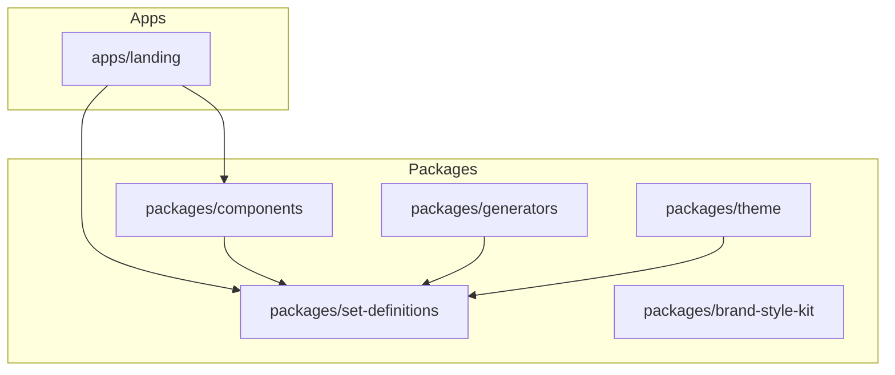

## Refactoring Roadmap

The following steps outline the refactoring process to fully implement the 'Generator Pipeline' strategy, centralizing set definitions and enabling robust document generation.

### Phase 1: Centralize Data
1.  **Migrate Edition Definitions:**
    *   Move the existing edition definitions (e.g., from `apps/landing/src/editions`) into the `packages/set-definitions` package.
    *   Ensure these definitions are exported correctly from `@clearline7/set-definitions`.
    *   Remove redundant local edition files from `apps/landing`.

### Phase 2: Build the Engine
1.  **Develop `StandardDocTemplate` Component:**
    *   Create a new React component, `StandardDocTemplate`, within `packages/components`.
    *   This component will act as the core rendering engine, consuming a `SetDefinition` instance.
    *   It should be capable of rendering document content according to the selected set definition, forming the basis for both web display and document generation.

### Phase 3: Build the Exporters
1.  **Scaffold Generator Adapters:**
    *   Within `packages/generators/src/adapters/`, create:
        *   `WordAdapter.ts`: An adapter to handle conversion of `StandardDocTemplate` content into `.docx` format, utilizing the `docx` library.
        *   `MarkdownAdapter.ts`: An adapter to handle conversion of `StandardDocTemplate` content into Markdown format.
    *   Implement an abstract `GeneratorAdapter` interface to ensure consistency and extensibility for future export formats.

### Phase 4: Reintegration
1.  **Update `apps/landing`:**
    *   Modify `apps/landing` to import `SetDefinition` instances directly from `@clearline7/set-definitions`.
    *   Integrate the new `StandardDocTemplate` from `@clearline7/components` for rendering.
    *   Update any existing routing or logic to utilize the centralized definitions and template.

## Dependency Graph (Post-Refactoring)

The following outlines the proposed dependency relationships within the monorepo after implementing the refactoring roadmap. All internal package dependencies will utilize the `workspace:*` protocol for pnpm.

**Key Dependencies:**
*   **`apps/landing`**: Will depend on `@clearline7/components` (for UI and `StandardDocTemplate`) and `@clearline7/set-definitions` (for consuming set definitions).
*   **`packages/components`**: Will depend on `@clearline7/set-definitions` (for the `SetDefinitionProvider` and the `SetDefinition` class used within `StandardDocTemplate`).
*   **`packages/generators`**: Will depend on `@clearline7/set-definitions` to access the definition data required for document generation.
*   **`packages/theme`**: Will depend on `@clearline7/set-definitions` to provide the `SetDefinitionProvider` context.
*   **`packages/brand-style-kit`**: Independent, provides core brand tokens.

## Missing Files & Directories

The following files and directories will need to be created or significantly modified as part of the refactoring process:

### `packages/components`
*   `src/StandardDocTemplate/` (New Directory for the core rendering component)
    *   `src/StandardDocTemplate/index.ts`
    *   `src/StandardDocTemplate/StandardDocTemplate.tsx`
    *   `src/StandardDocTemplate/style.css`
    *   `src/StandardDocTemplate/StandardDocTemplate.test.tsx`

### `packages/generators`
*   `src/adapters/` (New Directory for generator adapters)
    *   `src/adapters/GeneratorAdapter.ts` (Interface or Abstract Class for adapters)
    *   `src/adapters/WordAdapter.ts` (Implementation for .docx generation)
    *   `src/adapters/MarkdownAdapter.ts` (Implementation for Markdown generation)

